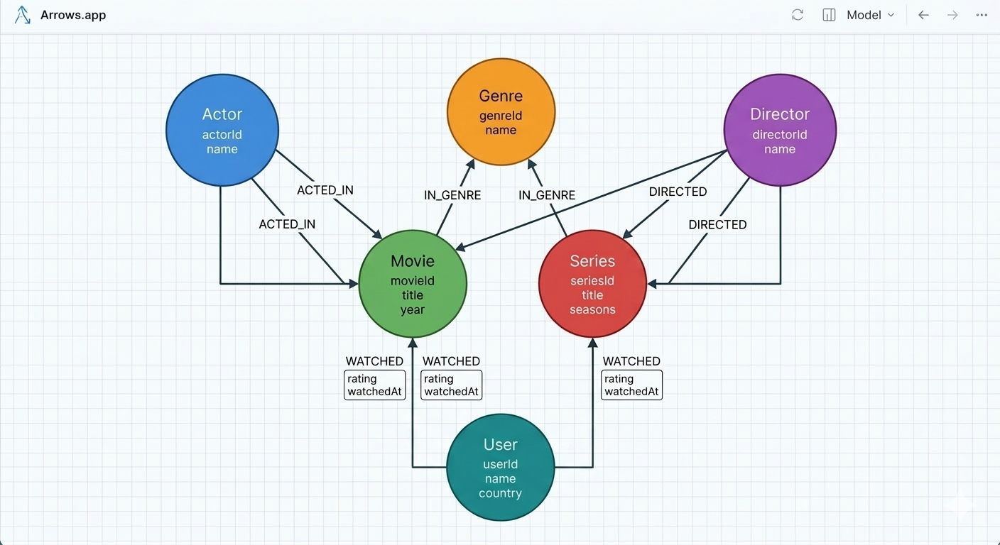
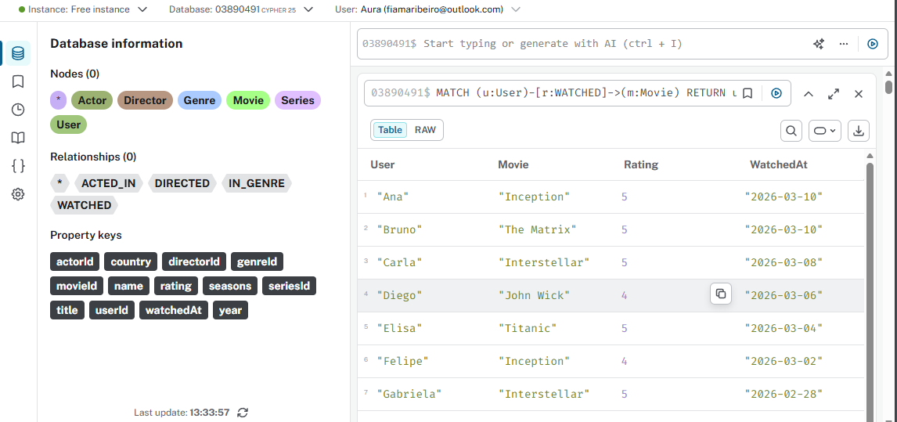
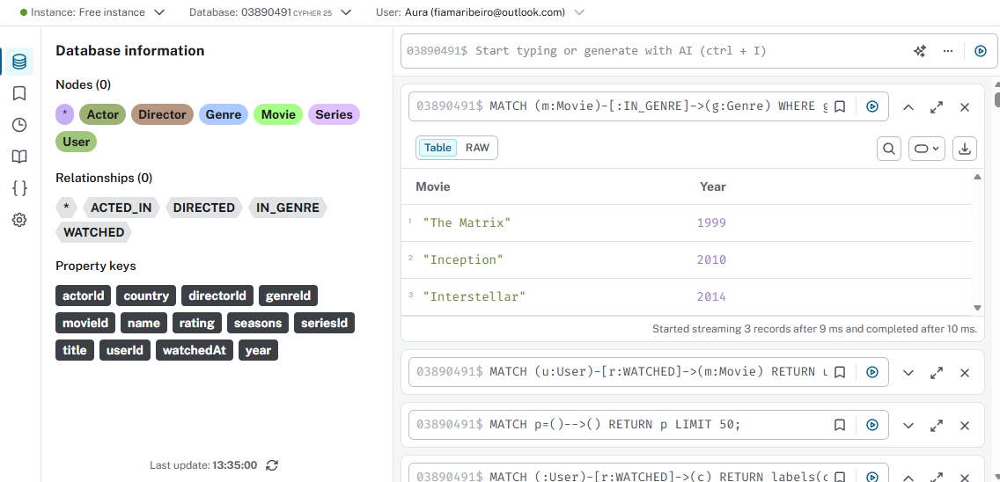
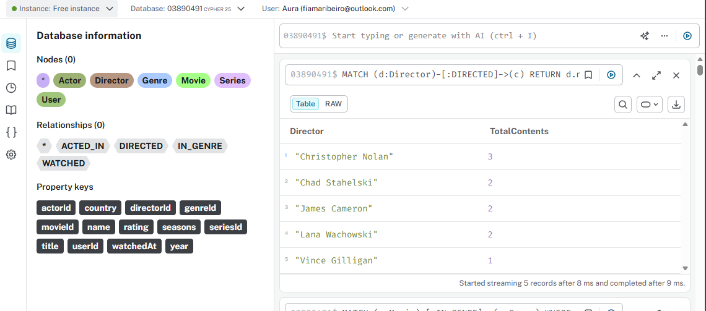
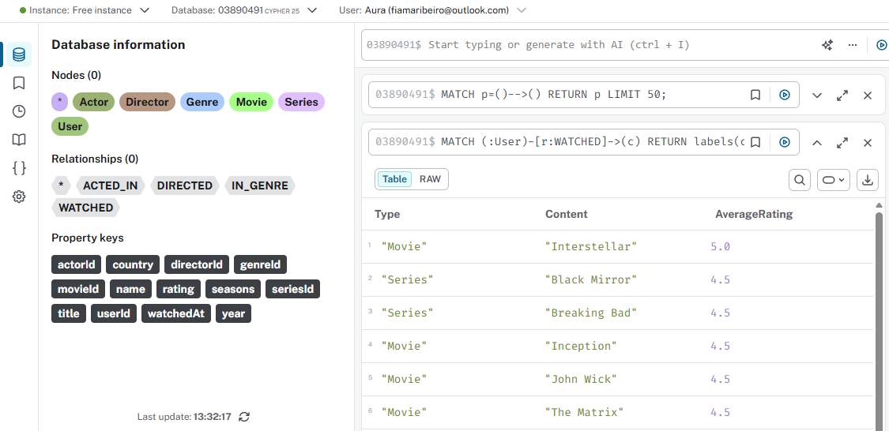
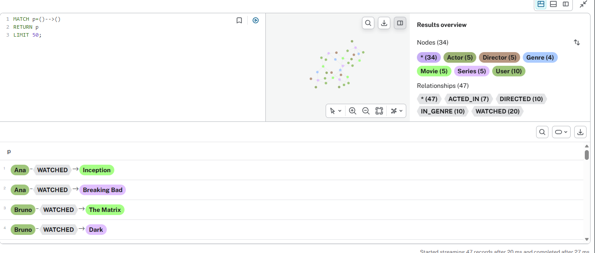

# Desafio DIO - Modelagem de Banco de Dados em Grafos com Neo4j

## Descrição do Projeto
Este projeto foi desenvolvido como parte de um desafio prático da DIO com foco em modelagem de banco de dados em grafos utilizando **Neo4j**.

A proposta consistiu em construir um grafo para representar o contexto de uma **plataforma de streaming**, conectando usuários, filmes, séries, gêneros, atores e diretores. Além da modelagem, o projeto também contempla a criação dos relacionamentos entre essas entidades, o registro de conteúdos assistidos e a execução de consultas de negócio com **Cypher**.

O objetivo foi aplicar, na prática, os principais conceitos de bancos de dados em grafos, desde a definição do modelo até a documentação de um repositório técnico com estrutura de portfólio.

---

## Contexto do Problema
Plataformas de streaming possuem uma estrutura fortemente baseada em relacionamentos. Nesse tipo de cenário, não basta armazenar dados isolados: é essencial representar como as entidades se conectam.

Neste projeto, foram considerados elementos como:
- usuários que assistem filmes e séries;
- conteúdos classificados por gênero;
- atores que participam de obras;
- diretores responsáveis por filmes e séries;
- avaliações atribuídas pelos usuários aos conteúdos assistidos.

Esse contexto torna o uso de grafos especialmente adequado, pois as conexões entre os dados são parte central do problema.

---

## Justificativa do Uso de Grafos
A escolha do **Neo4j** foi motivada pela necessidade de representar relações de forma intuitiva, visual e eficiente.

Em um banco relacional tradicional, esse tipo de problema exigiria várias tabelas intermediárias e múltiplas junções. Já em um banco de dados em grafo, as relações são tratadas como elementos de primeira classe, o que facilita tanto a modelagem quanto a consulta.

Com isso, o projeto permite responder de forma natural a perguntas como:
- Quais conteúdos um usuário assistiu?
- Quais filmes pertencem ao gênero Ficção Científica?
- Quais atores participaram de determinado conteúdo?
- Quais diretores possuem mais conteúdos cadastrados?
- Qual a média de avaliação dos conteúdos?

---

## Modelo do Grafo

### Nós
- `User {userId, name, country}`
- `Movie {movieId, title, year}`
- `Series {seriesId, title, seasons}`
- `Genre {genreId, name}`
- `Actor {actorId, name}`
- `Director {directorId, name}`

### Relacionamentos
- `(User)-[:WATCHED {rating, watchedAt}]->(Movie)`
- `(User)-[:WATCHED {rating, watchedAt}]->(Series)`
- `(Actor)-[:ACTED_IN]->(Movie)`
- `(Actor)-[:ACTED_IN]->(Series)`
- `(Director)-[:DIRECTED]->(Movie)`
- `(Director)-[:DIRECTED]->(Series)`
- `(Movie)-[:IN_GENRE]->(Genre)`
- `(Series)-[:IN_GENRE]->(Genre)`

### Representação visual do modelo


---

## Estrutura do Repositório
```bash
desafio-neo4j-streaming-dio/
├── README.md
├── dataset/
├── scripts/
└── images/
```
---

## Organização das pastas

- ` dataset/:` arquivos CSV com a estrutura de dados utilizada como base do projeto;
- ` scripts/:` scripts Cypher para criação de constraints, carga de nós, relacionamentos e consultas;
- ` images/:` imagens do modelo e evidências visuais das consultas realizadas;
- ` README.md:` documentação principal do projeto.

## Dataset
O repositório contém arquivos CSV representando os dados do cenário de streaming, incluindo:
- usuários
- filmes
- séries
- gêneros
- atores
- diretores
- relacionamentos entre os dados

Os arquivos CSV foram mantidos no projeto como dataset de apoio e documentação da estrutura de dados. Para a execução no Neo4j Aura, a carga foi adaptada para scripts Cypher, garantindo compatibilidade com o ambiente utilizado.

## Scripts
### `01-constraints.cypher`
Cria restrições de unicidade para os identificadores principais dos nós, evitando duplicidade de registros.

### `02-carga-nos.cypher`
Responsável pela criação dos nós principais do grafo:
- usuários;
- filmes;
- séries;
- gêneros;
- atores;
- diretores.

### `03-carga-relacionamentos.cypher`
Cria os relacionamentos entre as entidades do projeto, incluindo:
- conteúdos assistidos pelos usuários;
- atores que participaram das obras;
- diretores responsáveis pelos conteúdos;
- classificação de filmes e séries por gênero.

### `04-consultas-negocio.cypher`
Contém as consultas utilizadas para demonstrar o funcionamento do modelo na prática.

---

## Resultados do Projeto
Após a carga dos dados, o grafo foi estruturado com:
- 34 nós
- 47 relacionamentos
- 6 tipos de nós
- 4 tipos principais de relacionamentos

Esses resultados permitiram validar a modelagem proposta e executar consultas de negócio com sucesso no Neo4j Aura.

---

## Consultas de Negócio
Algumas perguntas que o grafo consegue responder:

### 1. Quais usuários assistiram a filmes?


### 2. Quais filmes pertencem ao gênero Ficção Científica?


### 3. Quais diretores possuem mais conteúdos dirigidos?


### 4. Qual a média de avaliação dos conteúdos?


### 5. Visualização geral do grafo populado


## Como Executar
1. Criar uma instância no Neo4j Aura ou utilizar Neo4j Desktop.
2. Executar o script `01-constraints.cypher`.
3. Executar o script `02-carga-nos.cypher`.
4. Executar o script `03-carga-relacionamentos.cypher`.
5. Executar o script `04-consultas-negocio.cypher`.
6. Validar os resultados no Neo4j Browser.

## Observação
Embora o projeto inclua arquivos CSV no repositório, a carga final foi adaptada para execução direta em Cypher, devido às particularidades do ambiente Neo4j Aura.

---

## Dificuldades Encontradas
Durante o desenvolvimento, algumas dificuldades foram encontradas:
- compreensão inicial da lógica de modelagem em grafos;
- definição correta dos relacionamentos entre entidades;
- organização dos dados em arquivos CSV para documentar a estrutura;
- adaptação da carga para scripts Cypher executados diretamente no Aura;

---

## Soluções Aplicadas
Para superar essas dificuldades, foram adotadas as seguintes ações:
- construção prévia do modelo conceitual do grafo;
- uso de constraints para garantir integridade dos dados;
- organização dos dados em arquivos CSV
- adaptação da carga para execução direta em Cypher no Neo4j Aura

---

## Conclusão
Este projeto permitiu aplicar, de forma prática, conceitos fundamentais de banco de dados em grafos com Neo4j, incluindo:
- modelagem de entidades e relacionamentos;
- criação de constraints;
- manipulação de dados com Cypher;
- construção de consultas de negócio;
- documentação técnica voltada para portfólio.

Além do aprendizado técnico, o desafio reforçou a importância de estruturar um repositório de forma clara, organizada e profissional, tornando o projeto mais relevante para estudos futuros e entrevistas técnicas.

---

## Tecnologias Utilizadas
- Neo4j Aura
- Cypher
- Arrows.app
- GitHub

---

## Autor
Projeto desenvolvido por **Fiama Ribeiro** como parte do desafio prático da DIO sobre modelagem de banco de dados em grafos com Neo4j.
